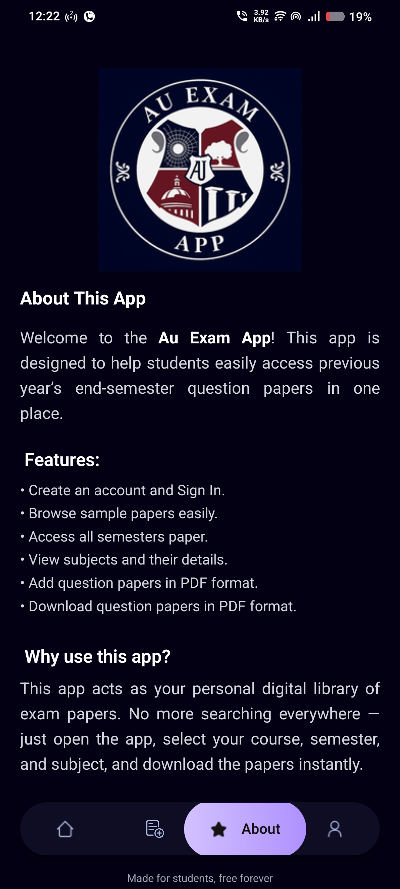
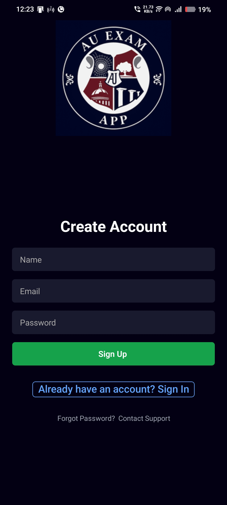
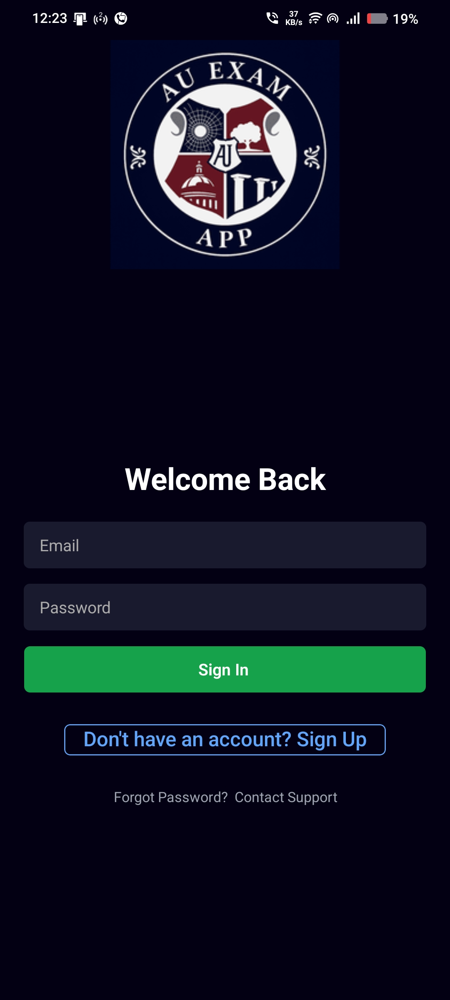
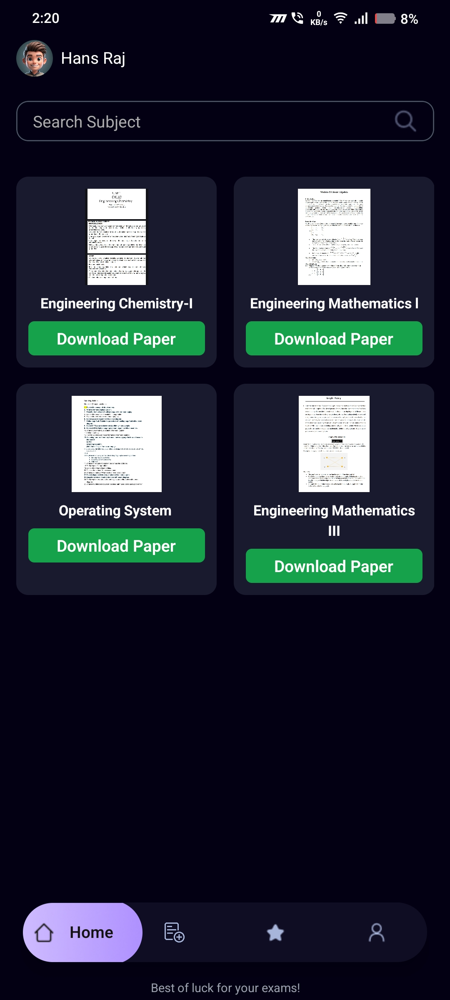
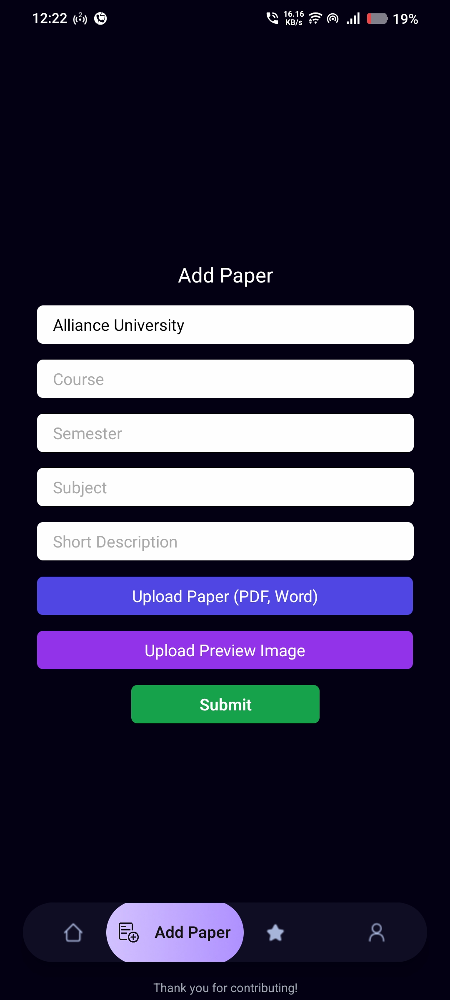
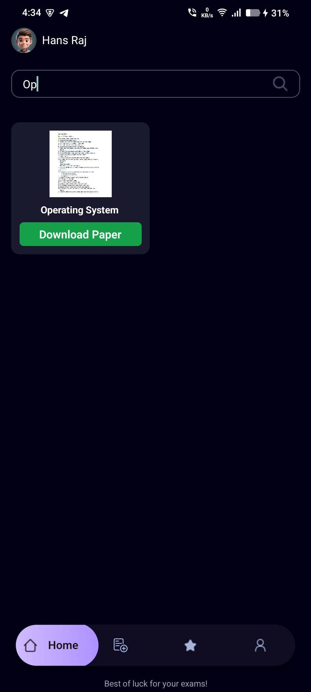
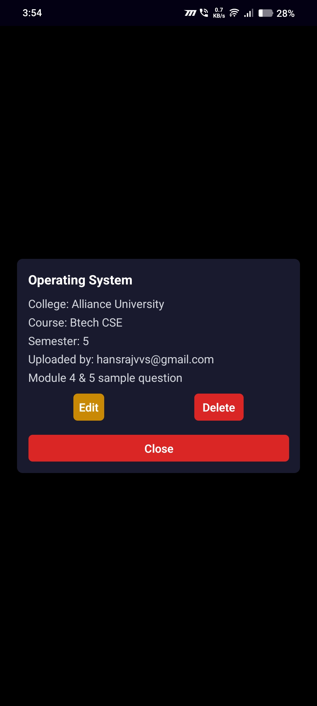
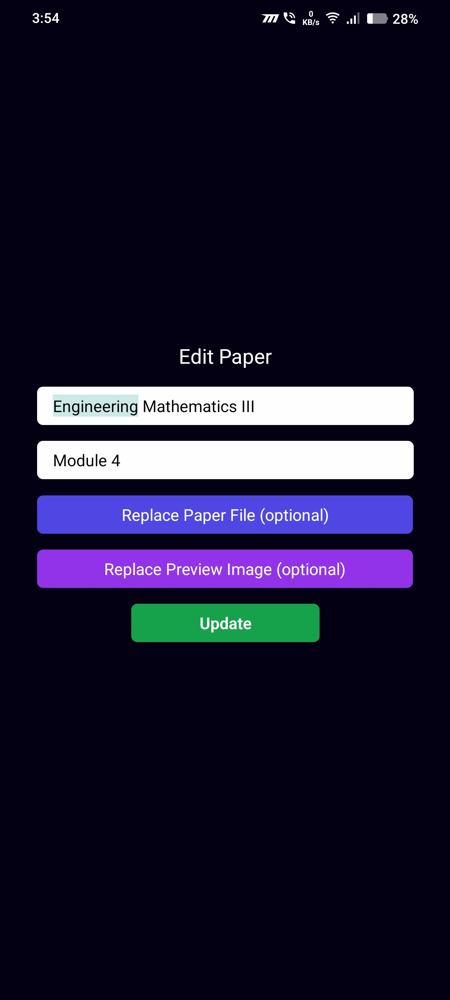
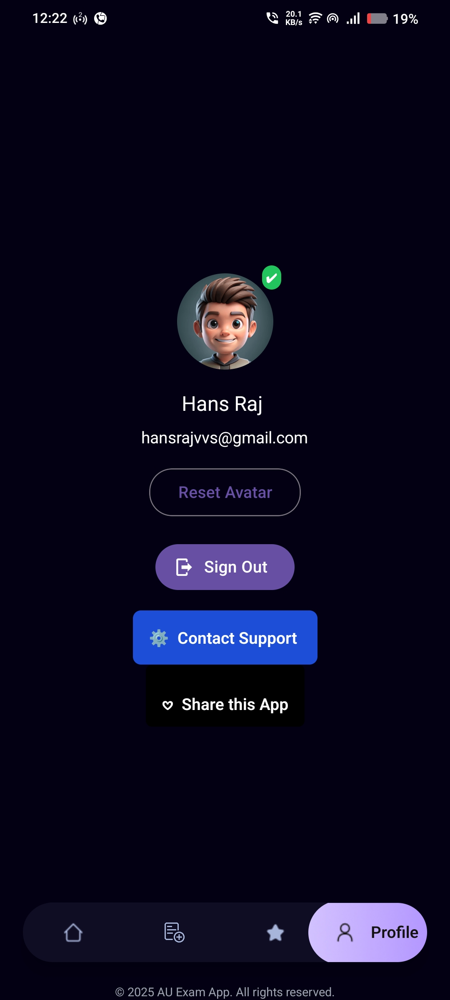

# AU Exam App
<h3> A full-stack mobile application for uploading and managing academic papers, built for Alliance University Students. Users can submit acadmic apapers, preview uploads, and manage content by subject, topic, and branch.</h3>

## App download Link : [Au Exam App](https://auexamapp.netlify.app/)
Backend Link : [Spring Boot ](https://github.com/HansrajS1/Au-Exam-App-backend)

<h3>📸 App Screenshots</h3>
<table>
  <tr>
    <td><br><p align="center"><strong>About Page</strong></p></td>
    <td><br><p align="center"><strong>Create Account</strong></p></td>
    <td><br><p align="center"><strong>Sign-In Page</strong></p></td>
  </tr>
  <tr>
    <td><br><p align="center"><strong>Home Dashboard</strong></p></td>
    <td><br><p align="center"><strong>Add Paper</strong></p></td>
    <td><br><p align="center"><strong>Search Paper</strong></p></td>
  </tr>
  <tr>
    <td><br><p align="center"><strong>Paper Details</strong></p></td>
    <td><br><p align="center"><strong>Edit Paper</strong></p></td>
    <td><br><p align="center"><strong>Profile Page</strong></p></td>
  </tr>
</table>

##  Features

-  Upload academic papers (PDF/WORD)
-  Upload preview images
-  Select university, course, semester, subject.
-  Authentication via Appwrite
-  Context-based routing with Expo Router
-  Native APK build with full offline support
-  Real-device testing and crash-free deployment

---

##  Tech Stack

| Layer       | Technology                     |
|-------------|--------------------------------|
| Frontend    | React Native + Expo Router     |
| Backend     | [Spring Boot (REST API)](https://github.com/HansrajS1/Au-Exam-App-backend)      |
| Database	  |PostgreSQL                      |
| Auth        | Appwrite                       |
| Styling     | NativeWind + Tailwind CSS      |
| Build Tools | EAS Build / Android Studio / CLI |
| Debugging   | ADB + Hermes + Logcat          |

---

##  Installation

```bash
git clone https://github.com/HansrajS1/Au-Exam-App
cd Au-Exam-App
npm install
```

---

##  Development

```bash
npx expo start
```

To test with native modules:

```bash
eas build --profile development
npx expo start --dev-client
```

---

##  Building APK Locally

### Option 1: Android Studio

1. Run `npx expo prebuild`
2. Open `android/` folder in Android Studio
3. Go to **Build > Build APK(s)**
4. Find APK at `android/app/build/outputs/apk/release/app-release.apk`

### Option 2: CLI

```bash
npx expo prebuild
cd android
./gradlew clean
./gradlew assembleRelease
```

Install on device:

```bash
adb install app/build/outputs/apk/release/app-release.apk
```

---

##  Environment Variables

Create a `.env` file:

```env
APPWRITE_ENDPOINT=https://cloud.example.io/v1
APPWRITE_PROJECT_ID=your_project_id
```

Use `react-native-dotenv` to load them.


---

##  Troubleshooting

- **White placeholder text in APK**  
  → Set `placeholderTextColor="#000"` explicitly

- **Hermes crash on APK boot**  
  → Guard `segment[0]` and context access in `RouterGuard`

- **Appwrite auth warning**  
  → Ensure `AuthProvider` wraps layout in `_layout.tsx`

- **EAS build fails**  
  → Use `./gradlew assembleRelease` locally instead

---

##  Author

**HANS RAJ**
bengaluru, India  

---

##  License

MIT — feel free to fork, extend, and deploy.
